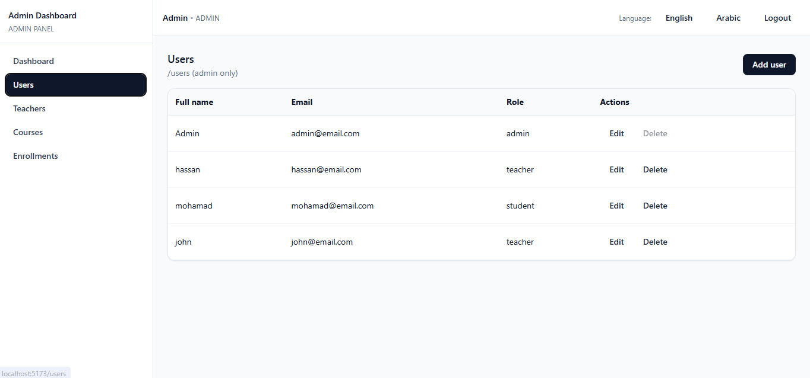
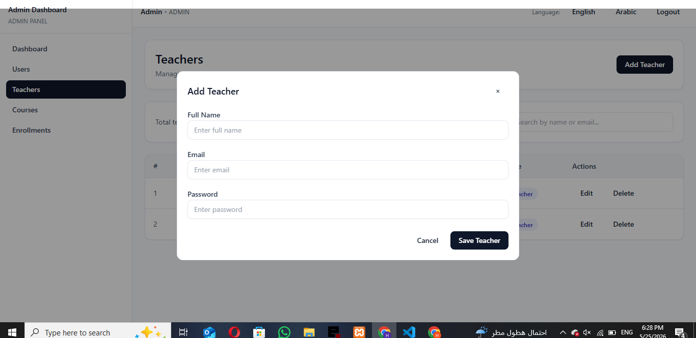
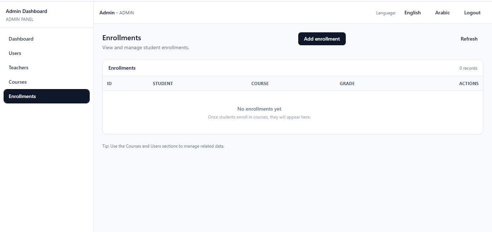

# 🎓 Student Management System


---

## 🚀 Overview

A full-stack Student Management System built using a clean backend architecture and modern frontend technologies.

The system allows managing students, courses, and enrollments with secure authentication and role-based access control.

---

## 🛠 Tech Stack

### 🔹 Backend
- Node.js
- Express.js
- MySQL
- JWT Authentication
- Clean Architecture (Controller / Service / Repository Pattern)

### 🔹 Frontend
- React (Vite)
- Tailwind CSS
- Axios

---

## ✨ Features

- 🔐 Secure authentication using JWT
- 👤 User management
- 🎓 Student CRUD operations
- 📚 Course management
- 📝 Enrollment system
- 🔒 Role-based access control
- 🧩 Layered backend architecture
- ⚙ Environment-based configuration

---

## 📂 Project Structure

### Backend
```txt
controllers/
services/
repositories/
middlewares/
routes/
config/
```

### Frontend
```txt
src/
components/
pages/
services/
```

---

## ⚙ Installation

### 1️⃣ Clone the repository
```bash
git clone https://github.com/your-username/student-management-system.git
cd student-management-system
```

### 2️⃣ Setup Backend
```bash
cd Backend
npm install
```

Create a `.env` file using `.env.example` then run:
```bash
npm run dev
```

### 3️⃣ Setup Frontend
```bash
cd frontend
npm install
```

Create a `.env` file using `.env.example` then run:
```bash
npm run dev
```

---

## 🔑 Environment Variables

### Backend
```env
PORT=
JWT_SECRET=
DB_HOST=
DB_USER=
DB_PASSWORD=
DB_NAME=
```

### Frontend
```env
VITE_API_BASE_URL=
```

---

## 📸 Screenshots

### 🔐 Login Page


### 📊 Dashboard


### 🎓 Users Page


### 🎓 Teachers Page


### 📚 Courses Page


### 📚 Enrollments Page


---

## 📌 Architecture Notes

This project follows a layered architecture separating:

- **Controllers** → Handle HTTP logic  
- **Services** → Business logic  
- **Repositories** → Database access  

This improves scalability, maintainability, and testability.

---

## 👨‍💻 Author

**Hassan Abdallah**  
Full-Stack Web Developer
